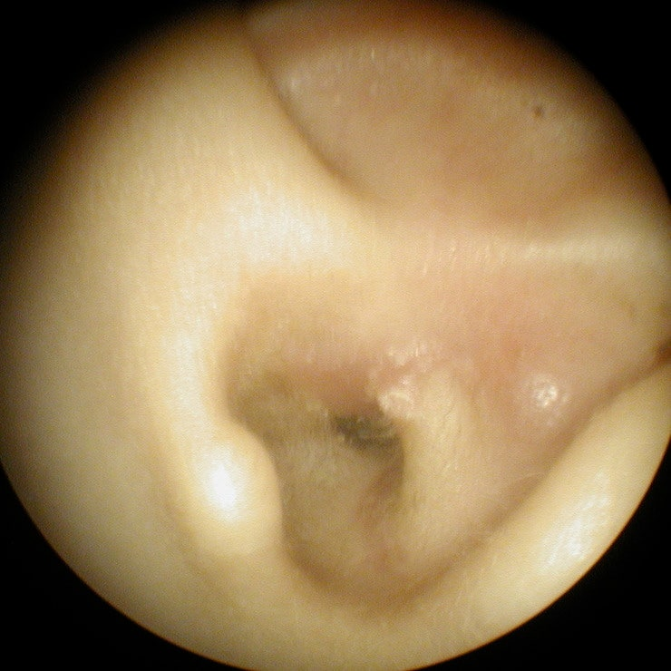
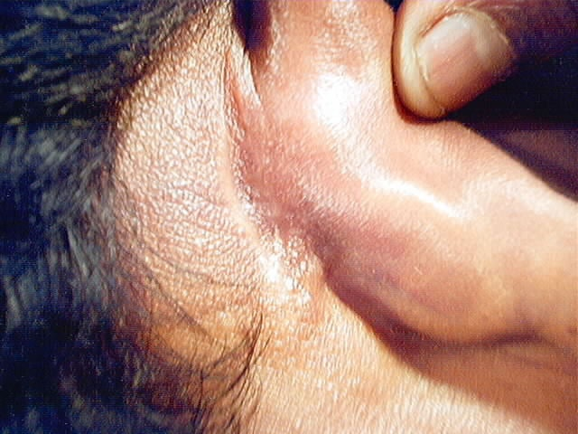
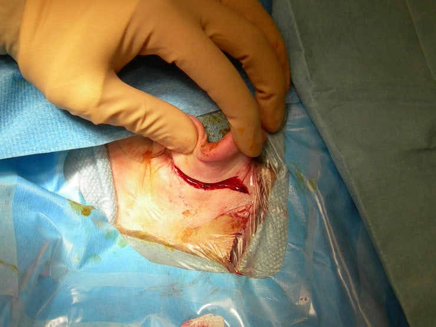

# 선천성 진주종의 레이저 최소절개 LASIC 수술 네이버 카페



### 선천성 진주종의 레이저 수술이란?

선천성 진주종은 고막 안쪽  [소리뼈](ossicle.md)에 붙어있는 것이 특징인 종양입니다.&#x20;

소리뼈는 소리의 압력에도 진동하도록 되어있기 때문에\
사람 손과 기구로 이소골을 건드리면 손상의 가능성이 많습니다.

따라서 일반 수술기구를 사용할 때 사람의 손을 소리의 압력 정도로만 움직여야 하는데\
사실상 불가능한 일이라서\
이소골에서 진주종을 떼어내기보다는\
이소골을 아예 제거해버리는 술식을 택하는 경우가 많습니다.

그러나 레이저는 소리의 압력보다 더 낮은 빛이라서 이소골에 닿을 때 매우 안전하지요.\
이소골을 그대로 둔 상태에서\
이소골로부터 진주종을 분리해낼 수 있습니다.

또한 진단이 불확실한 경우 조기 확진에도 유용하고

수술시 최소절개를 통해 수술시간을 대폭 감소할 수 있습니다.

### 3줄 요약.

1. 소리뼈는 손으로 만지기 힘든 구조이지만
2. 레이저를 사용해서 안전하게 완전히 제거하고
3. 외부 절개를 최소화하는 수술을 말합니다.

따라서 레이저 진주종 수술의 장점은

* 귀뒤 절개의 합병증, 흉터가 없다.
* 소아에서 귀뒤 절개로 합병증 걱정이 없기 때문에 조기 수술이 가능하다
* 수술 시간, 입원 시간이 짧고 상처 회복이 빠르다.
* 귀뒤 유양동을 제거하지 않기 때문에 중이염이 생기지 않는다.
* 이소골을 제거하지 않기 때문에 청력보존률이 높다.
* 진주종 재발률이 적다.
* 2차 수술 가능성이 적다.\
  등입니다.

병원 입장에서 수익성은 그다지 없지만&#x20;

부모님 입장에서는 이보다 더 좋을 수는 없다. As good as it gets.

### 진주종의 크기별로 보면 

1기는 어떻게 수술해도 수술 결과가 좋기 때문에 - 절개가 작다는 것이 가장 큰 차이가 되겠습니다.\
2기 이상인 경우 절개가 작을 뿐만 아니라\
유양동을 제거하지 않기 때문에\
중이염이 덜 생기고 귀의 구조를 유지하는\
추가적인 장점이 있겠습니다.\
특히 3기면 2번 이소골을 제거하기 때문에\
일반적으로 보통 2차 수술이 12개월 이내 필요하지만\
레이저 수술은 주종 완전 제거가 되어\
처음 수술 시 제거한 이소골을 다시 연결까지 하기 때문에\
2차 수술이 반드시 필요하지 않아서 수술이 한 번으로 끝날 때가 많습니다.\
4기는 어차피 중이염이 심하고 유양동을 제거하기 때문에\
레이저를 사용해도 귀뒤 큰 절개가 필요할 수 있습니다.\
진주종을 제거해도 중이염이 심한 경우 귀뒤절개가 필요한데\
4기 중이염의 20% 정도에서 귀뒤절개가 필요할 수 있으며\
수술 전에 MRI 를 통해서 이러한 경우를 구별하고 있습니다.

### 선천성 진주종의 조기 수술을 위한 최소 절개 수술

소아 진주종은 종양처럼 계속 자라기 때문에 진행을 늦출 방법이 없고 조기 수술이 필요합니다.\
선천성 진주종의 치료에서 가장 중요한 것은\
조기 발견과 조기 수술이라고 외국 논문에 이미 다 보고된 바 있습니다.

그러나 한국에서는 성인 진주종 수술 방식 그대로 소아에게 적용하는 술식 때문에\
조기 수술이 잘 안 되는 경우가 많은 편입니다.

보통 성인의 진주종 수술은 진주종 제거를 위해서 이소골과 유양동을 다 제거해버리는 경우가 많습니다.\
이소골을 제거할 경우 수술 후 청력손실이 더 심해지고\
유양동을 제거할 경우 평생 귀에서 이루가 있을 수 있기 때문에\
특히 소아에서 조기 수술을 못 하는 이유가 되기도 했습니다.

다소 파괴적인 성인 진주종 수술을 소아에게 하면 안 되겠다고 생각하고\
제가 연수 기간 동안 배워서 하고 있는 수술이 최소 절개 레이저 진주종 수술입니다.\
단순하게 흉터가 없는 것도 겉으로 보이는 장점이지만\
3기 진주종까지는 청력 보존과 유양동 보존이 가능한 점이 사실은 더욱 큰 장점이겠습니다.

특별한 합병증이 남지 않기 때문에 조기 수술이 가능하고\
빨리 수술할 수록 재발률이 없기 때문에 조기 수술이 가능한 최소절개수술이 중요하겠습니다.\
맹장 수술을 절개하고 할 것인지 복강경으로 할 것인지와 비슷해서\
수술자가 처음 배울 때 어렵다는 것이고 환자 입장에서 완전 제거되면 치료결과는 동일합니다.

### 최소절개의 수술후 사진

귓구멍 안으로 흉터가 나게 됩니다.

<figure><figcaption></figcaption></figure>

**후방절개의 흉터 사진**

아래는 레이저 없이 수술할 때 후방절개를 통한 수술입니다.

성인 귀수술에 가장 흔히 쓰이는 절개 방법입니다.

절개 부위 및 흉터가 어느 정도인지 교과서에 잘 나와있습니다.

영문 교과서인 다음의 링크를 참고하시면 되겠습니다.

http://emedicine.medscape.com/article/860860-media

<figure><figcaption>
후방 절개 수술 후 
</figcaption></figure>

<figure><figcaption>
후방 절개 위치 
</figcaption></figure>

절개부의 흉터가 머리카락에 가리기 때문에

사실 귀뒤 절개를 한다고 해서 미용상의 문제는 전혀 없습니다 .

유양동까지 침범된 4기 진주종이거나

동반된 중이염이 심한 상태면 절개를 통해 유양동을 없애는 술식이 더 좋을 수도 있겠습니다.
