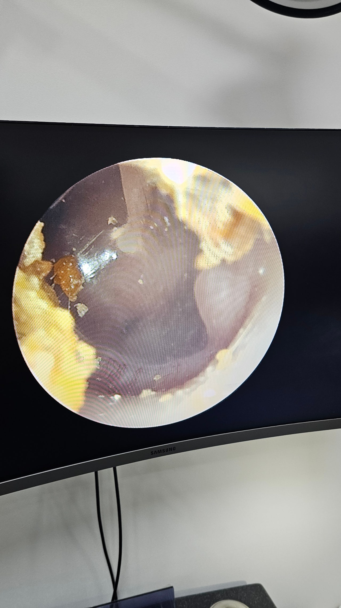
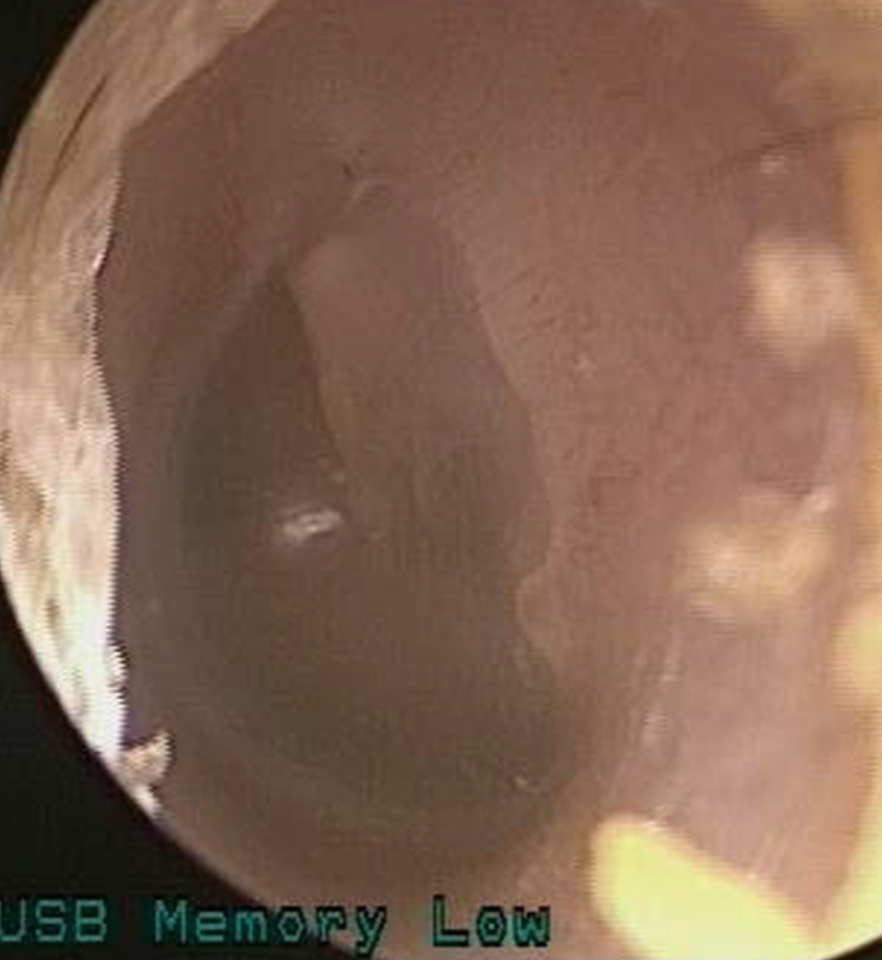

# not chole 진주종으로 오진 = 진주종처럼 보이지만 진주종이 아닌 경우 (소아 선천성)

<figure><figcaption>
<a href="https://cafe.naver.com/earlaser/42798">https://cafe.naver.com/earlaser/42798</a>
</figcaption></figure>

#### 심지어는 대학병원 교수님도 선천성 진주종은 잘 모르고 CT 를 계속 찍기도 하세요&#x20;

`경희대에서 ct를찍어서 가져갔고여`

`교수님께서 확인해보셨고여`&#x20;

`근데 교수님께서 저희애가 진주종이 아니라고 말씀을 해주셨어여 ..`

`제가 약6시간정도 걸려 진료를본거라서 제대로여쭤보지못한부분이있어서여..`

`분명 일주일전 7월6일에 경희대에서 귀를봤을때 진주종이고 크기도 작지 안타고했었고 수술을권하셨거든여`

`일주일사이에 진주종이 없어지는경우도있나여...?믿겨지지가안아서여...좋기도하지만 혹시나 하는마음이 들어서여`\
`[출처]` [`교수님 너무 궁금합니다 (소중한 아이들 이비인후과 이비인닷컴)`](https://cafe.naver.com/earlaser/23757) `| 작성자` [`예지맘사랑`](https://cafe.naver.com/earlaser.cafe?iframe_url=%2Fca-fe%2Fcafes%2F12763967%2Fmembers%2FEVhcPaF7tXLKsMddOjfWUw)&#x20;

<figure><figcaption></figcaption></figure>

