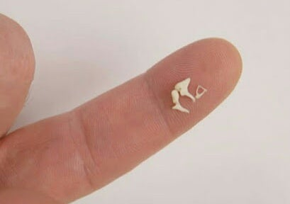
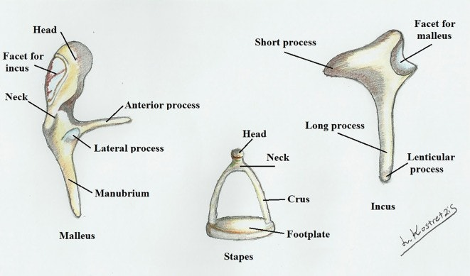
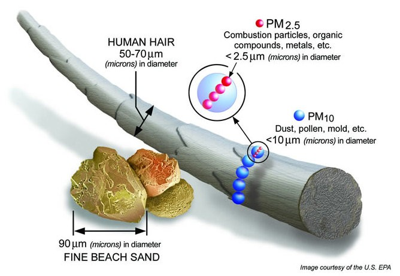

# ossicle story 소리뼈를 아시나요

이소골 이야기 Ossicles

사람의 몸은 206개의 뼈조각으로 이루어지는데 이중 가장 작은 뼈 3개가 귀 (중이) 안에 존재합니다.

세반고리관 안에 물론 더 작은 칼슘 이석이 존재하지만 이건 뼈로 취급하지 않습니다.

고막과 달팽이관 사이에 3개의 이소골이 있는데 각각 추골 malleus, 침골 incus, 등골 stapes 라고 합니다.

편의상 1번, 2번, 3번 이소골이라고 하겠습니다.

<figure><figcaption></figcaption></figure>

!\[img]\(/Users/gg/Library/Mobile Documents/com~~apple~~CloudDocs/image/이소골 이야기 네이버 카페/ossifinger.jpg)

이소골이 작다는 것이 실감나는 것은 역시 위의 사진입니다.

수술할 때 왜 레이저가 필요한지 알 수 있습니다.

옛날에는 사진이 아니라 이렇게 아래 같은 그림을 가지고 의학 공부를 했습니다.

<figure><figcaption></figcaption></figure>

작은 이소골인데도 기묘하게 맞물린 구조를 가지고 있어서 왠만하면 고막이나 자기 위치에서 분리되지 않습니다.

### 이소골 고막 중 어느 것이 더 중요할까요.&#x20;

쌈질하다가 고막이 터지면 걱정하는데 고막은 쉽게 자연 재생이나 수술이 가능하기 때문에 상해 진단서 2\~3주 정도만 진단기간이 됩니다.

그러나 이소골까지 탈구 또는 손상되었다면&#x20;

이건 죽지 않아서 감사할 정도로 강한 충격이었기 때문에 최소 4주 상해 진단이 되는데,&#x20;

이소골 손상 또난 회복하기 힘든 경우도 많습니다.

서로서로 맞물려 있기 때문에 제자리를 벗어나면  서로 연결이 되지 않습니다.

### 이소골 수술은 왜 사람의 손으로 힘들까?

이소골의 무게는 1,2,3번 이소골이 각각 25mg, 27mg, 3mg 입니다 .

3번 이소골 무게 3mg 이면 333개를 모아야 겨우 1그램이 되는 군요.

그래서 끝이 머리카락처럼 가는 픽을 사용해서 수술하는데 이도 힘듭니다 .

이쑤시개로 한 번 툭 건드리기만 해도 1미터는 날아가겠군요.

### 이소골의 크기

#### 이소골 중  가작 작은 3번 이소골이 3밀리 미터 정도 됩니다 .

아래처럼 세부 구조를 나누기 시작하면 진주종 수술 시 흔히 레이저로 분리하는 stapes crura

두께는 200 마이크로 미터 정도 입니다.

따라서 착점 크기가 200 마이크로 미터인 의학용 (초정밀) CO2 레이저를 사용해서 수술을 하고 있습니다.

<figure><figcaption></figcaption></figure>

사람이 현미경 없이 맨눈으로 볼 수 있는 최소 크기가 50 마이크로 미터 정도 된다고 합니다. 가는 머리카락 굵기.

먼지는 그래서 눈에 안 보이죠. 10 마이크로 정도 .

2.5 마이크로 이하는 미세 먼지라고 해서 폐에서 걸러내지도. 못 해서 축적되구요.

### 이소골이 하는 일

이소골 3개가 어떻게 어느 방향으로 연결되서 고막과 주위 공간에 붙어있는지는 안궁 (아무도 안 궁금해) 이고

롤렉스 손목 시계 톱니처럼 평생 움직이면서 잘 때도 쉬지 않고 소리를 전달하는 역할을 합니다.

이소골이 움직여서 소리를 듣게 되는 과정은 너 튜브에 흔히 볼 수 있습니다.



사족. 이소골이 없었다면 귀수술도 편도선 수술만큼 간단한 수술이 될 수 있지 않았을까 생각합니다.

3개의 이소골 때문에 귀수술 특히 이소골 수술은 신경외과 수술만큼 어려운 수술 중의 하나가 되서

기본 수술 현미경만 몇 억씩 필요한 수술이 되었습니다

