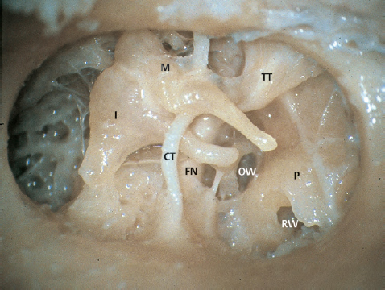
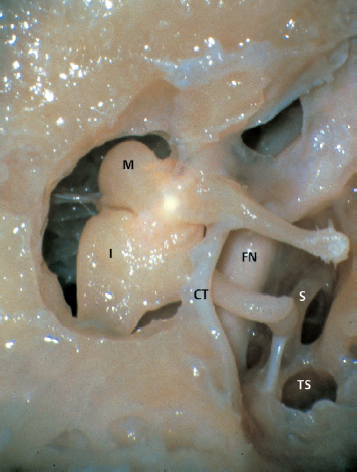
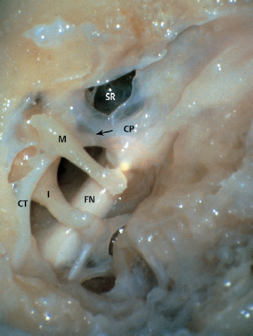
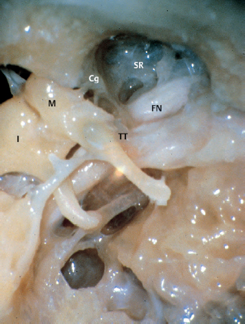
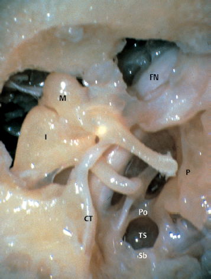
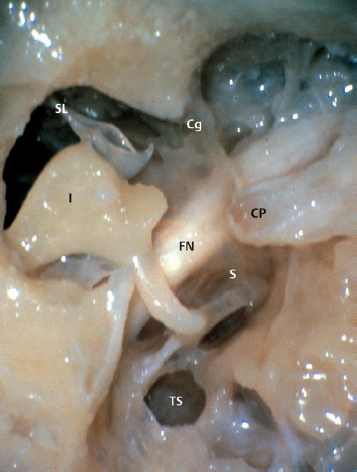
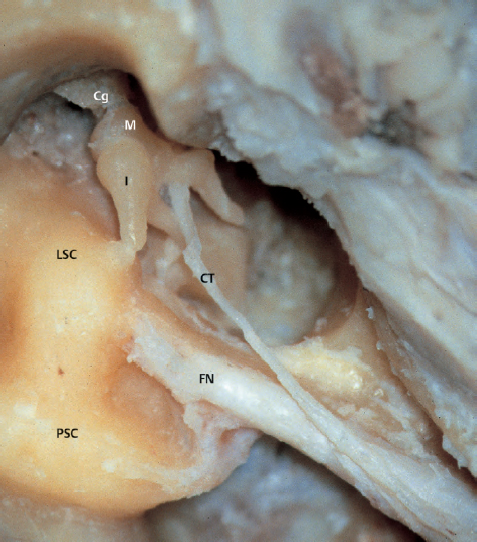
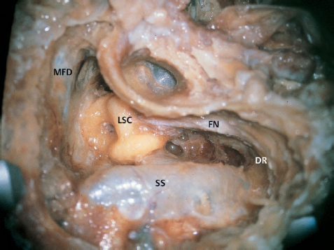
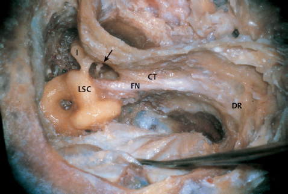

# Anatomy ... of the temporal bone

인터넷에 흔히 나오는 교과서 고막 사진 설명입니다.

!\[img]\(/Users/gg/Library/Mobile Documents/com~~apple~~CloudDocs/image/이소골의 세계 - gitbook 추가/20.png)

고막 안을 열면 무엇이 보일까요..

수술할 때 고막을 분리하면 이소골이 잘 보이게 됩니다.

아래는 실제 소아 진주종 수술시 보는 장면과 유사한 사진입니다.

10배 현미경 확대한 사진이고 아래 원크기가 1cm 정도라고 생각하시면 됩니다.

<figure><figcaption></figcaption></figure>

여기다가 껌을 이곳저곳에 붙여놓은 다음에 이소골과 분리하는 게 진주종 수술입니다.

!\[]\(/Users/gg/Library/Mobile Documents/com~~apple~~CloudDocs/image/이소골의 세계/image3 7.jpeg)

!\[image-20250417121701086]\(/Users/gg/Library/Mobile Documents/com~~apple~~CloudDocs/image/이소골의 세계 - gitbook 추가/image-20250417121701086.png)

```
**Fig. 1.1** The structures in the right tympanic cavity are shown **after atticotomy** and partial removal of the posterior canal wall. The bone is placed in a similar position to that during surgery. Important structures in the medial wall of the middle ear are shown.CTchorda tympaniFNfacial nerveIincusMmalleusOWoval windowPpromontoryRWround window nicheTTtensor tympani
```

<div><figure><figcaption></figcaption></figure> <figure><figcaption></figcaption></figure> <figure><figcaption></figcaption></figure> <figure><figcaption></figcaption></figure> <figure><figcaption></figcaption></figure> <figure><figcaption></figcaption></figure></div>

그럼 실제 크기는 이 정도 . .

이걸 어떻게 사람의 손으로 수술하나요... 시계 부품보다 작은데 손대면 망가지지요.

이런 그림을 보고 다 외려면 미칠 것같지 않습니까.

!\[img]\(/Users/gg/Library/Mobile Documents/com~~apple~~CloudDocs/image/이소골의 세계 - gitbook 추가/22.png)

다행히 요즘 사진이 있습니다만.

이걸 수술해보고 이해하는데 20년이 걸린다고 생각합니다.

전문의 10년차 펠로우 조교수 넘어가도 수술할 기회가 그닥 오지 않고 해볼까 말까 한 부분이라서

또 아래 사진처럼 비슷비슷해보이지만 현미경 각도에 따라서 획획 달라지기 때문에

1년 에 한 두번 수술 해보고 어디가 어디인지 알기가 힘듭니다.

그래서 이소골을 몽창 제거해버릴 때가 많습니다.

그리고 청력이 나쁜 성인 진주종은 원래 이소골을 제거하는 수술을 하는 게 원칙적입니다.

소아는 좀 다릅니다만. 그래도 제거해야 한다고 생각하는 귀하신 분들이 많습니다.

!\[]\(/Users/gg/Library/Mobile Documents/com~~apple~~CloudDocs/image/이소골의 세계/image4 6.jpeg)

**Fig. 1.2** The structures at higher magnification.

CTchorda tympaniFNfacial nerveFRfacial recessIincusMmalleusPEpyramidal eminencePoponticulusRWround window nicheSstapes

!\[]\(/Users/gg/Library/Mobile Documents/com~~apple~~CloudDocs/image/이소골의 세계/image5 6.jpeg)

**Fig. 1.3** The structures seen after small atticotomy.

CTchorda tympaniFNfacial nerveIincusMmalleusSstapesTStympanic sinus

!\[]\(/Users/gg/Library/Mobile Documents/com~~apple~~CloudDocs/image/이소골의 세계/image6 6.jpeg)

**Fig. 1.4** Structures in the medial wall of the mesotympanum viewed from the anteroinferior direction. The tendon of the tensor tympani is seen (arrow). Note the protrusion of the facial nerve and its proximity to the oval window.

CPcochleariform processCTchorda tympaniFNfacial nerveIlong process of the incusMmanubrium of the malleusSRsupratubal recess

!\[]\(/Users/gg/Library/Mobile Documents/com~~apple~~CloudDocs/image/이소골의 세계/image7 6.jpeg)

**Fig. 1.5** The lateral wall of the supratubal recess is opened and the medial wall is seen from an anterolateral direction. The cog, located just anterior to the head of the malleus, divides the supratubal recess from the attic. The pregeniculate portion of the facial nerve is seen in the bottom of the recess. The nerve runs immediately superior to the tensor tympani muscle.

CgcogFNfacial nerve IincusMmalleusSRsupratubal recessTTtensor tympani muscle

!\[]\(/Users/gg/Library/Mobile Documents/com~~apple~~CloudDocs/image/이소골의 세계/image8 6.jpeg)

**Fig. 1.6** Another view of the same specimen. The tympanic sinus is located anteroinferiorly to the facial nerve, and the facial recess is located just lateral to the nerve. The deep tympanic sinus and large anterior attic recess are shown. The tympanic sinus is divided into two parts by the ponticulus. The tympanic sinus is bordered inferiorly by the subiculum.

CTchorda tympaniFNfacial nerveIincusMmalleusPpromontoryPoponticulusSbsubiculumTStympanic sinus

!\[]\(/Users/gg/Library/Mobile Documents/com~~apple~~CloudDocs/image/이소골의 세계/image9 6.jpeg)

**Fig. 1.7** The malleus is removed and the supratubal recess is opened laterally. The cog separating the recess from the attic is clearly seen. The pregeniculate portion of the facial nerve is located in the bottom of the supratubal recess anteriorly to the malleus, and runs between the cog and the cochleariform process.

CgcogCPcochleariform processFNfacial nerveIincusSstapesSLsuperior suspensory ligamentTStympanic sinus

!\[]\(/Users/gg/Library/Mobile Documents/com~~apple~~CloudDocs/image/이소골의 세계/image10 6.jpeg)

**Fig. 1.8** The posterior canal wall and the tympanic membrane have been removed. Semicircular canals are skeletonized. The chorda tympani enters the tympanic cavity through the posterior wall and runs laterally to the long process and medially to the neck of the malleus.

!\[image-20250417121855300]\(/Users/gg/Library/Mobile Documents/com~~apple~~CloudDocs/image/이소골의 세계 - gitbook 추가/image-20250417121855300.png)

!\[image-20250417121906052]\(/Users/gg/Library/Mobile Documents/com~~apple~~CloudDocs/image/이소골의 세계 - gitbook 추가/image-20250417121906052.png)

!\[image-20250417121914708]\(/Users/gg/Library/Mobile Documents/com~~apple~~CloudDocs/image/이소골의 세계 - gitbook 추가/image-20250417121914708.png)

!\[image-20250417121934141]\(/Users/gg/Library/Mobile Documents/com~~apple~~CloudDocs/image/이소골의 세계 - gitbook 추가/image-20250417121934141.png)

!\[image-20250417121944003]\(/Users/gg/Library/Mobile Documents/com~~apple~~CloudDocs/image/이소골의 세계 - gitbook 추가/image-20250417121944003.png)

!\[image-20250417121952347]\(/Users/gg/Library/Mobile Documents/com~~apple~~CloudDocs/image/이소골의 세계 - gitbook 추가/image-20250417121952347.png)

전문의 되면 처음 시작하는 수술이 성인 만성 중이염 수술이긴 한데

보통 다음이 기본 시야입니다.

아래 그림에서 LSC 라고 표시된 부분은 이소골이 아닙니다.

LSC 는 세반고리관인데 적어도 크기가 10 mm 는 되니까 이소골이 얼마나 어려운 부위에 있는지 알 수 있습니다.&#x20;

이소골 보고 수술하는 게 아니라서 위에서 보신  귀수술 100 개 이상 해도 이소골 한 번 못 볼 때가 많습니다.

이소골 수술을 1차 수술 후 6개월 따로 한다고 많이 하는 것도 이소골 수술을 이 시야에서 하기 힘들기 때문입니다.&#x20;


<figure><figcaption></figcaption></figure>


성인 진주종 수술해서 다음과 같은 수준되서 이소골 (화살표 . I표시 ) 겨우 볼 수 있는 경지에 이른 사람도 많이 없습니다.

<figure><figcaption></figcaption></figure>

