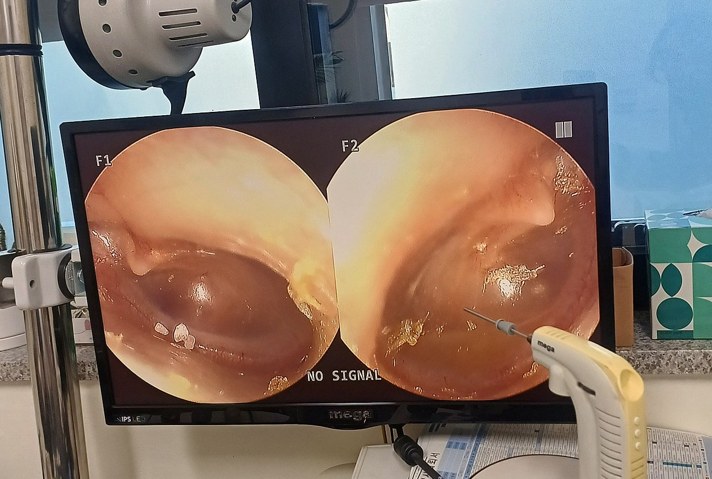

# 중이염 튜브 수술을 남용하지 말자



5살부터 중이염이 걸리면 나아지지가 않아 수술 직전까지 갔다가 수술직전에 물이 빠져 수술하지않고를 몇번이나 반복하였고 어찌저찌 지금 8살까지 수술하지않고 버티고 있는 상황입니다.

선생님께서 설하면역 치료를 해보라고 하셔서 지금 1년2개월째하고 있고 면역치료 시작한 뒤로는 감기가 걸려 중이염이 걸려도 시간이 지나면 물이 빠지고 있어 병원에 안가본지 오래 되었는데요

오늘 감기로 병원에 가니 약간의 중이염이 있고 고막 함몰은 여전히 있는데 설하면역치료 열심히 하면 되는건지 아님 귀에 물이 빠져도 함몰로 인해 튜브시술 해야하는건지 궁금합니다.

오늘 찍은 사진 올리겠습니다

<figure><figcaption></figcaption></figure>

.

약간의 중이염에 왜 수술을 생각하세요 .\
중이염 수술은 20점 짜리 아이를 60 점 만든다고 생각하시면 됩니다.\
지금 중이염은 70점 이상 좋은 상태입니다.

개인 병원이라도 이비인후과시면 수술 필요하면 다 말씀해주십니다
